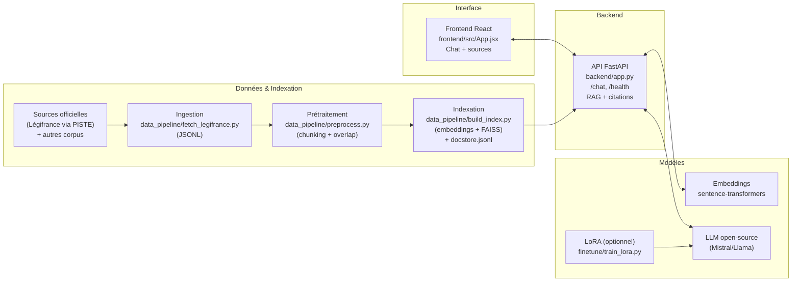
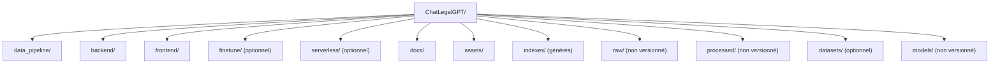

# ChatLegalGPT - assistant IA pour comprendre le droit français (RAG + LoRA)

> « J’aimerais connaître mes droits, mais je ne comprends pas les textes de loi et je n’ai pas le temps de les lire. »

ChatLegalGPT est un projet **end‑to‑end** : ingestion → indexation → API RAG → interface web → (option) fine‑tuning LoRA.

⚠️ **Disclaimer** : information générale uniquement, ne remplace pas un avis juridique professionnel.

---

## Schéma global


---

## Structure du dépôt (vue synthétique)



---

## Quickstart (local)

### 1) Cloner
```bash
git clone https://github.com/P-Pix/ChatLegalGPT.git
cd ChatLegalGPT
```

### 2) Préparer un index minimal (exemple)
Créer un dump JSONL : `raw/legifrance_dump.jsonl` (1 JSON par ligne) :
```json
{"text":"...", "source":{"origin":"legifrance_api","id":"...","title":"...","date":"...","url":"..."}}
```

Puis :
```bash
python3 data_pipeline/preprocess.py
python3 data_pipeline/build_index.py
```

### 3) Backend
```bash
cd backend
python3 -m venv .venv
source .venv/bin/activate
pip install -r requirements.txt
uvicorn app:app --reload --port 8000
```

### 4) Frontend
Dans un autre terminal :
```bash
cd frontend
npm install
npm run dev
```

UI : http://localhost:5173  
API : http://localhost:8000/health

---

## Lire la doc par dossier
Chaque dossier contient un README détaillé avec un schéma Mermaid :
- `data_pipeline/README.md`
- `backend/README.md`
- `frontend/README.md`
- `finetune/README.md`
- `serverless/README.md`

---

## Licence
Code sous licence **MIT** (voir `LICENSE`).  
Les contenus Légifrance / PISTE sont réutilisables sous conditions (licence/CGU/quota) : à respecter selon votre mode d’accès.
