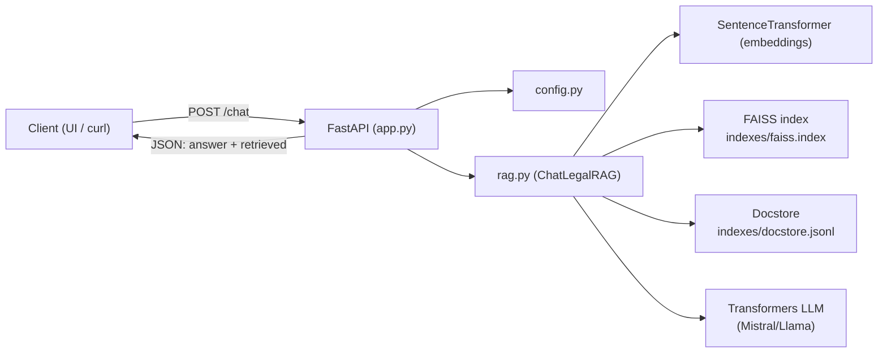

# backend/ — API FastAPI (RAG + citations)

Ce dossier expose l’API qui orchestre :
1) **vectorisation** de la question,
2) **recherche** des extraits top‑k (FAISS),
3) **construction du prompt** avec règles strictes,
4) **génération** par un LLM open‑source,
5) retour de la réponse + **sources**.

## Schéma



## Fichiers
- `app.py` : endpoints `/chat` + `/health`, CORS, rate limiting (SlowAPI)
- `rag.py` : retrieval + génération + formatage des sources
- `prompts.py` : prompt système (règles juridiques)
- `config.py` : variables d’environnement (model, index paths, CORS, etc.)
- `requirements.txt` : dépendances backend

## Lancer en local
```bash
cd backend
python -m venv .venv
source .venv/bin/activate
pip install -r requirements.txt

# Assurez-vous d'avoir construit indexes/faiss.index et indexes/docstore.jsonl
uvicorn app:app --reload --port 8000
```

## Variables d’environnement utiles
- `CHATLEGALGPT_MODEL` : modèle HF (LLM)
- `CHATLEGALGPT_EMBED` : modèle d’embeddings
- `CHATLEGALGPT_FAISS_INDEX` : chemin FAISS
- `CHATLEGALGPT_DOCSTORE` : chemin docstore
- `CHATLEGALGPT_TOP_K` : nombre d’extraits
- `CHATLEGALGPT_CORS_ORIGINS` : ex `http://localhost:5173`

## Exemple curl
```bash
curl -s http://localhost:8000/chat \
  -H "Content-Type: application/json" \
  -d '{"question":"Quels sont mes droits en cas de rupture de période d’essai ?"}' | jq
```
