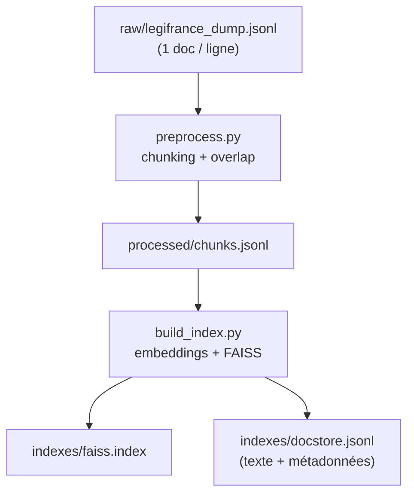

# data_pipeline/ — ingestion → chunks → index FAISS

Le pipeline construit l’index utilisé par le backend.

## Schéma



## Format d’entrée attendu (JSONL)
Chaque ligne :
```json
{"text":"...","source":{"origin":"legifrance_api","id":"...","title":"...","date":"...","url":"..."}}
```

## Scripts
- `fetch_legifrance.py` : **squelette** d’ingestion PISTE (à adapter aux endpoints)
- `preprocess.py` : découpe en chunks (avec overlap)
- `build_index.py` : embeddings + indexation FAISS + docstore

## Exécuter
```bash
python data_pipeline/preprocess.py
python data_pipeline/build_index.py
```

## Conseils “prod”
- conserver les métadonnées (id, date, url)
- versionner l’index (date, périmètre)
- ajouter un reranker (cross-encoder) si besoin
