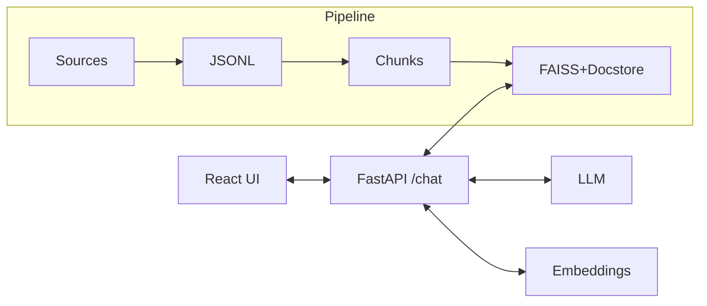

# Architecture

## Objectif
ChatLegalGPT est un assistant d'information juridique sur le droit français, conçu pour :
- répondre en langage simple
- citer des **sources officielles**
- refuser / signaler quand les sources ne suffisent pas

## Composants
### 1) Pipeline données
- Ingestion (Légifrance via PISTE) -> `raw/*.jsonl`
- Prétraitement (chunking) -> `processed/chunks.jsonl`
- Embeddings + index FAISS -> `indexes/faiss.index` + `indexes/docstore.jsonl`

### 2) Backend API (FastAPI)
- Endpoint `POST /chat`
- RAG :
  - embed question
  - recherche top-k chunks
  - prompt avec extraits + règles + citations

### 3) Frontend (React)
- UI chat simple
- affichage des sources récupérées

### 4) Fine-tuning (optionnel)
- LoRA SFT : apprend surtout le format et le comportement de refus
- Le RAG reste la source de vérité

## Pourquoi RAG d'abord ?
- plus fiable (réponses ancrées sur textes fournis)
- plus facile à mettre à jour (nouvel index)
- moins coûteux qu'un fine-tune massif

## Diagramme

