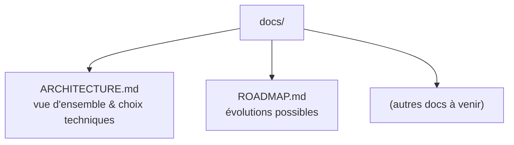

# docs/

Documentation du projet.

## Schéma

```mermaid
flowchart TB
  D["docs/"] --> A["ARCHITECTURE.md<br/>vue d'ensemble & choix techniques"]
  D --> R["ROADMAP.md<br/>évolutions possibles"]
  D --> C["(autres docs à venir)"]
```

## Fichiers
- `ARCHITECTURE.md`
- `ROADMAP.md`
