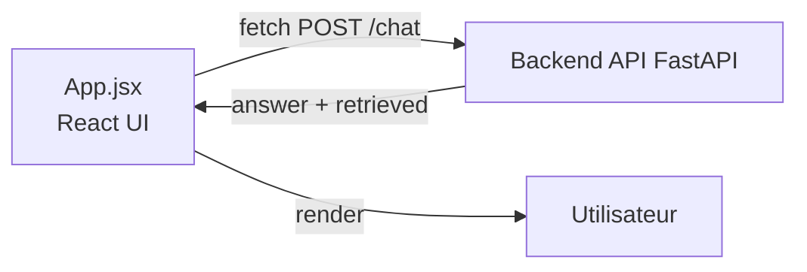

# frontend/ — UI web (React + Vite)

Interface chat minimaliste :
- champ de saisie
- affichage de la réponse
- **section “Sources récupérées”** (top‑k chunks)

## Schéma



## Fichiers
- `src/App.jsx` : UI chat + affichage des sources
- `src/main.jsx` : bootstrap React
- `.env.example` : `VITE_API_URL=http://localhost:8000`
- `vite.config.js` : config Vite

## Lancer
```bash
cd frontend
npm install
npm run dev
```

## Config API
Créer un `.env` (non versionné) :
```bash
cp .env.example .env
# puis éditer VITE_API_URL si besoin
```
