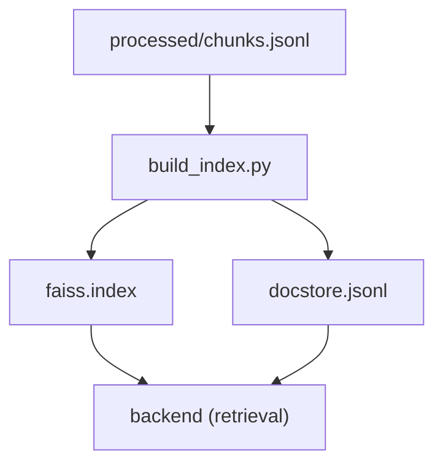

# indexes/ (générés)

Ce dossier contient l’index vectoriel utilisé par le backend.

Fichiers attendus :
- `faiss.index`
- `docstore.jsonl`

> Ces fichiers sont **générés** (souvent non versionnés).  
> Pour les produire : voir `data_pipeline/README.md`.
