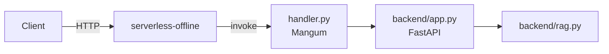

# Serverless (Lambda-like) + test local

## Schéma




Objectif : exécuter l'API FastAPI comme une fonction AWS Lambda (ou équivalent), et tester localement.

## Pré-requis
- Node.js >= 18
- Le framework Serverless : `npm i -g serverless` (ou `npx serverless`)
- Python 3.11

## Installation (local)
```bash
cd serverless
npm install
python -m venv .venv && source .venv/bin/activate
pip install -r requirements.txt
```

## Lancer en local (serverless-offline)
```bash
# Dans serverless/
npx serverless offline --stage local
```

URL locale (par défaut) :
- `http://localhost:3000/health`
- `http://localhost:3000/chat` (POST)

### Variables d'env
Le handler attend les chemins d'index :
- `CHATLEGALGPT_FAISS_INDEX`
- `CHATLEGALGPT_DOCSTORE`

Pour un test rapide, générez un petit index via le pipeline (voir README racine), puis exportez:
```bash
export CHATLEGALGPT_FAISS_INDEX=../indexes/faiss.index
export CHATLEGALGPT_DOCSTORE=../indexes/docstore.jsonl
```

## Déployer sur AWS (optionnel)
Vous devrez configurer credentials AWS et packaging. Ce dépôt fournit un squelette.


## Contenu du dossier
- `serverless.yml` : config Serverless
- `handler.py` : wrapper Mangum pour FastAPI
- `requirements.txt` : deps python
- `test_local.sh` : smoke test local
- `package.json` : deps Node (serverless-offline)
